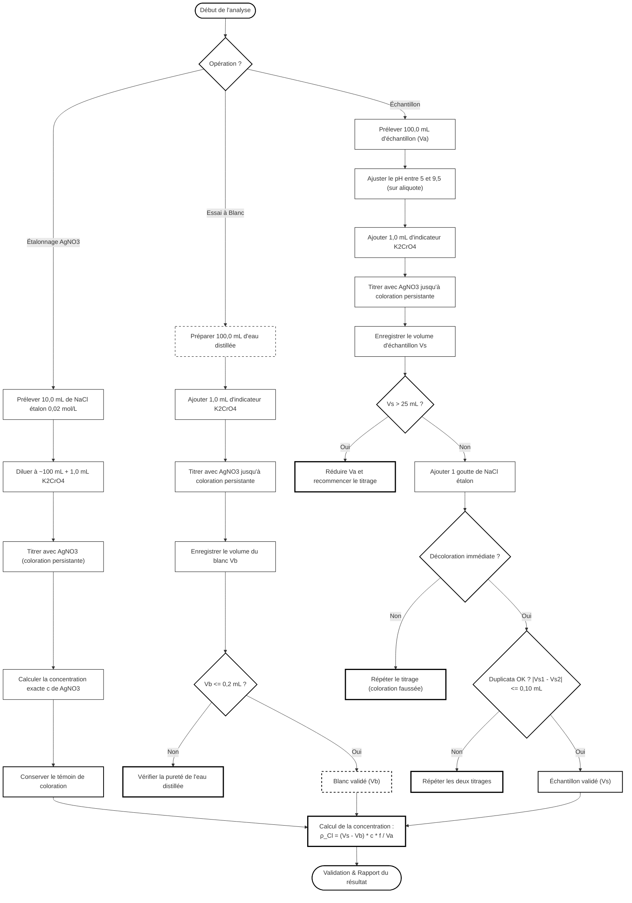

# Organigramme du Dosage des Chlorures par la Méthode de Mohr (ISO 9297)

Voici l'enchaînement des étapes opératoires et des critères de validation analytiques :

```mermaid
graph TD
    %% Organigramme
    Start(["Début de l'analyse"]) --> Dispatch{"Opération ?"}

    %% --- CHEMIN A : ÉTALONNAGE ---
    Dispatch -->|Étalonnage AgNO3| E1["Prélever 10,0 mL de NaCl étalon 0,02 mol/L"]
    E1 --> E2["Diluer à ~100 mL + 1,0 mL K2CrO4"]
    E2 --> E3["Titrer avec AgNO3 (coloration persistante)"]
    E3 --> E4["Calculer la concentration exacte c de AgNO3"]
    E4 --> E5["Conserver le témoin de coloration"]

    %% --- CHEMIN B : ESSAI À BLANC ---
    Dispatch -->|Essai à Blanc| B1["Préparer 100,0 mL d'eau distillée"]
    B1 --> B2["Ajouter 1,0 mL d'indicateur K2CrO4"]
    B2 --> B3["Titrer avec AgNO3 jusqu'à coloration persistante"]
    B3 --> B4["Enregistrer le volume du blanc Vb"]
    B4 --> B5{"Vb <= 0,2 mL ?"}
    B5 -->|Non| B_Fail["Vérifier la pureté de l'eau distillée"]
    B5 -->|Oui| B_Ok["Blanc validé (Vb)"]

    %% --- CHEMIN C : ÉCHANTILLON ---
    Dispatch -->|Échantillon| S1["Prélever 100,0 mL d'échantillon (Va)"]
    S1 --> S2["Ajuster le pH entre 5 et 9,5 (sur aliquote)"]
    S2 --> S3["Ajouter 1,0 mL d'indicateur K2CrO4"]
    S3 --> S4["Titrer avec AgNO3 jusqu'à coloration persistante"]
    S4 --> S5["Enregistrer le volume d'échantillon Vs"]
    S5 --> S6{"Vs > 25 mL ?"}
    S6 -->|Oui| S_Dil["Réduire Va et recommencer le titrage"]
    S6 -->|Non| S7["Ajouter 1 goutte de NaCl étalon"]
    S7 --> S8{"Décoloration immédiate ?"}
    S8 -->|Non| S_Fail["Répéter le titrage (coloration faussée)"]
    S8 -->|Oui| S9{"Duplicata OK ? |Vs1 - Vs2| <= 0,10 mL"}
    S9 -->|Non| S_Fail2["Répéter les deux titrages"]
    S9 -->|Oui| S_Ok["Échantillon validé (Vs)"]

    %% --- CALCULS ---
    E5 --> Calc
    B_Ok --> Calc
    S_Ok --> Calc

    Calc["Calcul de la concentration :<br>ρ_Cl = (Vs - Vb) * c * f / Va"]
    Calc --> Final(["Validation & Rapport du résultat"])

    %% Styles individuels pour compatibilité maximale (Typora / Mermaid)
    style Start fill:#fff,stroke:#000,stroke-width:2px;
    style Final fill:#fff,stroke:#000,stroke-width:2px;
    style Dispatch fill:#fff,stroke:#000,stroke-width:2px;
    
    style E1 fill:#fff,stroke:#000,stroke-width:1px;
    style E2 fill:#fff,stroke:#000,stroke-width:1px;
    style E3 fill:#fff,stroke:#000,stroke-width:1px;
    style E4 fill:#fff,stroke:#000,stroke-width:1px;
    style E5 fill:#fff,stroke:#000,stroke-width:2px;
    
    style B1 fill:#fff,stroke:#000,stroke-width:1px,stroke-dasharray: 5 5;
    style B2 fill:#fff,stroke:#000,stroke-width:1px;
    style B3 fill:#fff,stroke:#000,stroke-width:1px;
    style B4 fill:#fff,stroke:#000,stroke-width:1px;
    style B5 fill:#fff,stroke:#000,stroke-width:2px;
    style B_Fail fill:#fff,stroke:#000,stroke-width:3px;
    style B_Ok fill:#fff,stroke:#000,stroke-width:2px,stroke-dasharray: 5 5;
    
    style S1 fill:#fff,stroke:#000,stroke-width:1px;
    style S2 fill:#fff,stroke:#000,stroke-width:1px;
    style S3 fill:#fff,stroke:#000,stroke-width:1px;
    style S4 fill:#fff,stroke:#000,stroke-width:1px;
    style S5 fill:#fff,stroke:#000,stroke-width:1px;
    style S6 fill:#fff,stroke:#000,stroke-width:2px;
    style S_Dil fill:#fff,stroke:#000,stroke-width:3px;
    style S7 fill:#fff,stroke:#000,stroke-width:1px;
    style S8 fill:#fff,stroke:#000,stroke-width:2px;
    style S9 fill:#fff,stroke:#000,stroke-width:2px;
    style S_Fail fill:#fff,stroke:#000,stroke-width:3px;
    style S_Fail2 fill:#fff,stroke:#000,stroke-width:3px;
    style S_Ok fill:#fff,stroke:#000,stroke-width:2px;
    
    style Calc fill:#fff,stroke:#000,stroke-width:3px;
```
