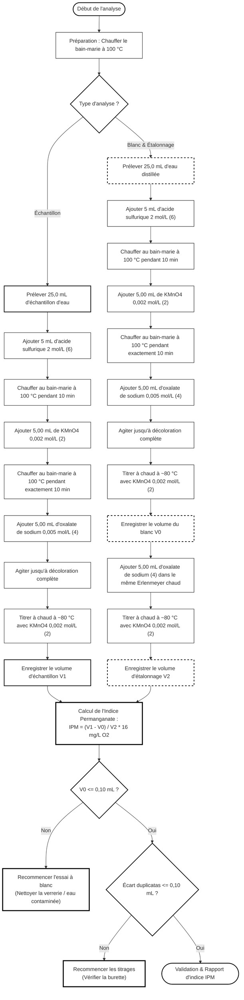

# Organigramme de la Détermination de l'Indice Permanganate (ISO 8467)

Voici l'enchaînement des étapes opératoires et des critères de validation analytiques :

```mermaid
graph TD
    %% Organigramme
    Start(["Début de l'analyse"]) --> Prep["Préparation : Chauffer le bain-marie à 100 °C"]
    Prep --> Dispatch{"Type d'analyse ?"}

    %% --- CHEMIN A : ÉCHANTILLON ---
    Dispatch -->|Échantillon| A1["Prélever 25,0 mL d'échantillon d'eau"]
    A1 --> A2["Ajouter 5 mL d'acide sulfurique 2 mol/L (6)"]
    A2 --> A3["Chauffer au bain-marie à 100 °C pendant 10 min"]
    A3 --> A4["Ajouter 5,00 mL de KMnO4 0,002 mol/L (2)"]
    A4 --> A5["Chauffer au bain-marie à 100 °C pendant exactement 10 min"]
    A5 --> A6["Ajouter 5,00 mL d'oxalate de sodium 0,005 mol/L (4)"]
    A6 --> A7["Agiter jusqu'à décoloration complète"]
    A7 --> A8["Titrer à chaud à ~80 °C avec KMnO4 0,002 mol/L (2)"]
    A8 --> A9["Enregistrer le volume d'échantillon V1"]

    %% --- CHEMIN B : ESSAI À BLANC & ÉTALONNAGE ---
    Dispatch -->|Blanc & Étalonnage| B1["Prélever 25,0 mL d'eau distillée"]
    B1 --> B2["Ajouter 5 mL d'acide sulfurique 2 mol/L (6)"]
    B2 --> B3["Chauffer au bain-marie à 100 °C pendant 10 min"]
    B3 --> B4["Ajouter 5,00 mL de KMnO4 0,002 mol/L (2)"]
    B4 --> B5["Chauffer au bain-marie à 100 °C pendant exactement 10 min"]
    B5 --> B6["Ajouter 5,00 mL d'oxalate de sodium 0,005 mol/L (4)"]
    B6 --> B7["Agiter jusqu'à décoloration complète"]
    B7 --> B8["Titrer à chaud à ~80 °C avec KMnO4 0,002 mol/L (2)"]
    B8 --> B9["Enregistrer le volume du blanc V0"]

    %% Étalonnage (Directement à la suite du blanc)
    B9 --> E1["Ajouter 5,00 mL d'oxalate de sodium (4) dans le même Erlenmeyer chaud"]
    E1 --> E2["Titrer à chaud à ~80 °C avec KMnO4 0,002 mol/L (2)"]
    E2 --> E3["Enregistrer le volume d'étalonnage V2"]

    %% --- CALCULS ---
    A9 --> Calc["Calcul de l'Indice Permanganate :<br>IPM = (V1 - V0) / V2 * 16 mg/L O2"]
    E3 --> Calc

    %% --- CONTRÔLE QUALITÉ ---
    Calc --> QC1{"V0 <= 0,10 mL ?"}
    QC1 -->|Non| QC_Fail_B["Recommencer l'essai à blanc<br>(Nettoyer la verrerie / eau contaminée)"]
    QC1 -->|Oui| QC2{"Écart duplicatas <= 0,10 mL ?"}
    QC2 -->|Non| QC_Fail_S["Recommencer les titrages<br>(Vérifier la burette)"]
    QC2 -->|Oui| Final(["Validation & Rapport d'indice IPM"])

    %% Styles individuels pour compatibilité maximale (Typora / Mermaid)
    style Start fill:#fff,stroke:#000,stroke-width:2px;
    style Final fill:#fff,stroke:#000,stroke-width:2px;
    
    style A1 fill:#fff,stroke:#000,stroke-width:2px;
    style A9 fill:#fff,stroke:#000,stroke-width:2px;
    
    style B1 fill:#fff,stroke:#000,stroke-width:2px,stroke-dasharray: 5 5;
    style B9 fill:#fff,stroke:#000,stroke-width:2px,stroke-dasharray: 5 5;
    style E3 fill:#fff,stroke:#000,stroke-width:2px,stroke-dasharray: 5 5;
    
    style Dispatch fill:#fff,stroke:#000,stroke-width:2px;
    style QC1 fill:#fff,stroke:#000,stroke-width:2px;
    style QC2 fill:#fff,stroke:#000,stroke-width:2px;
    
    style Calc fill:#fff,stroke:#000,stroke-width:3px;
    style QC_Fail_B fill:#fff,stroke:#000,stroke-width:3px;
    style QC_Fail_S fill:#fff,stroke:#000,stroke-width:3px;
    
    style Prep fill:#fff,stroke:#000,stroke-width:1px;
    style A2 fill:#fff,stroke:#000,stroke-width:1px;
    style A3 fill:#fff,stroke:#000,stroke-width:1px;
    style A4 fill:#fff,stroke:#000,stroke-width:1px;
    style A5 fill:#fff,stroke:#000,stroke-width:1px;
    style A6 fill:#fff,stroke:#000,stroke-width:1px;
    style A7 fill:#fff,stroke:#000,stroke-width:1px;
    style A8 fill:#fff,stroke:#000,stroke-width:1px;
    style B2 fill:#fff,stroke:#000,stroke-width:1px;
    style B3 fill:#fff,stroke:#000,stroke-width:1px;
    style B4 fill:#fff,stroke:#000,stroke-width:1px;
    style B5 fill:#fff,stroke:#000,stroke-width:1px;
    style B6 fill:#fff,stroke:#000,stroke-width:1px;
    style B7 fill:#fff,stroke:#000,stroke-width:1px;
    style B8 fill:#fff,stroke:#000,stroke-width:1px;
    style E1 fill:#fff,stroke:#000,stroke-width:1px;
    style E2 fill:#fff,stroke:#000,stroke-width:1px;
```
