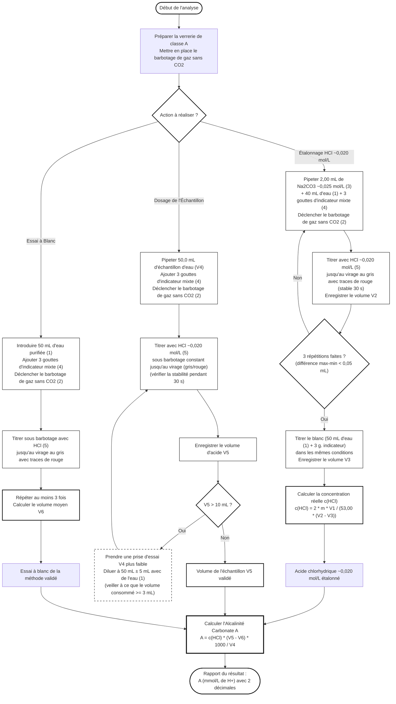

# Organigramme de la Détermination de l'Alcalinité Carbonate Visuelle (ISO 9963-2)

Voici l'enchaînement des étapes opératoires et des critères de validation analytiques pour la méthode visuelle uniquement :

