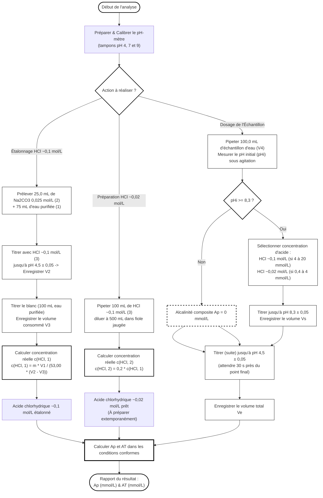

# Organigramme de la Détermination de l'Alcalinité Potentiométrique (ISO 9963-1)

Voici l'enchaînement des étapes opératoires et des critères de validation analytiques pour la méthode potentiométrique uniquement :

