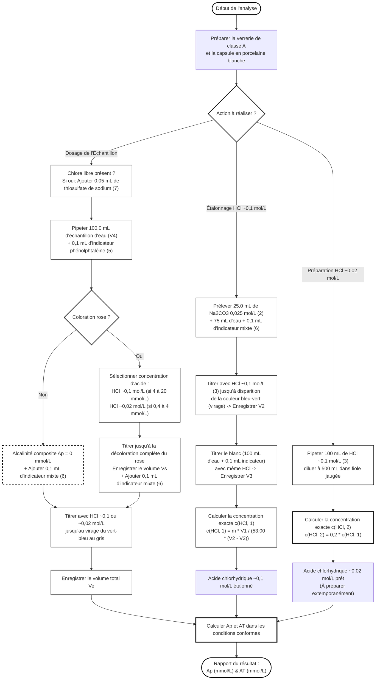

# Organigramme de la Détermination de l'Alcalinité Visuelle (ISO 9963-1)

Voici l'enchaînement des étapes opératoires et des critères de validation analytiques pour la méthode visuelle uniquement :

