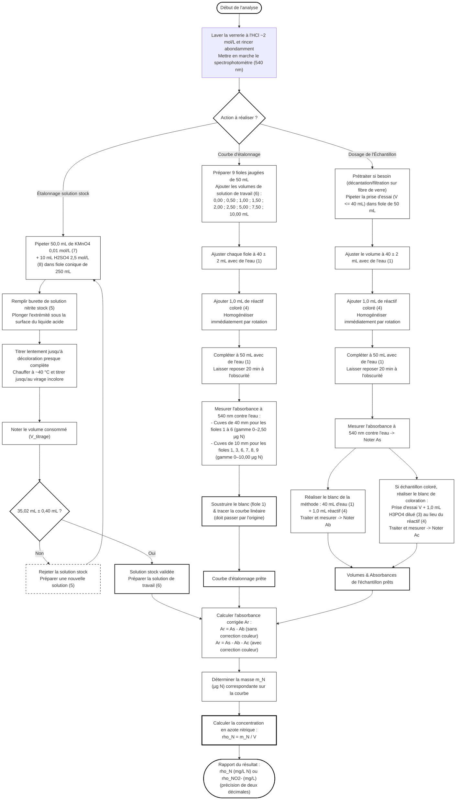

# Organigramme du Dosage des Nitrites par Spectrométrie d'Absorption (ISO 6777)

Voici l'enchaînement des étapes opératoires et des critères de validation analytiques pour le dosage des nitrites :

