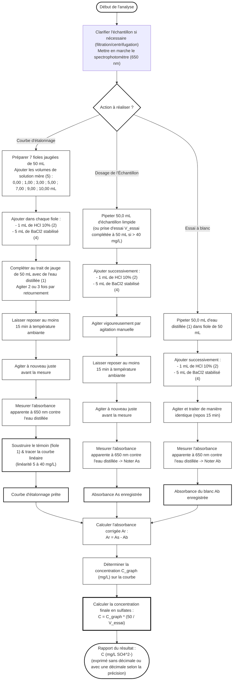

# Organigramme du Dosage des Sulfates par Néphélométrie (NF T 90-040)

Voici l'enchaînement des étapes opératoires et des critères de validation analytiques pour le dosage des ions sulfates :

```mermaid
graph TD
    %% Début de l'analyse
    Start(["Début de l'analyse"]) --> Prep["Clarifier l'échantillon si nécessaire (filtration/centrifugation)<br>Mettre en marche le spectrophotomètre (650 nm)"]
    Prep --> Dispatch{"Action à réaliser ?"}

    %% --- ETAPE 1 : COURBE D'ÉTALONNAGE ---
    Dispatch -->|"Courbe d'étalonnage"| C1["Préparer 7 fioles jaugées de 50 mL<br>Ajouter les volumes de solution mère (5) :<br>0,00 ; 1,00 ; 3,00 ; 5,00 ; 7,00 ; 9,00 ; 10,00 mL"]
    C1 --> C2["Ajouter dans chaque fiole :<br>- 1 mL de HCl 10% (2)<br>- 5 mL de BaCl2 stabilisé (4)"]
    C2 --> C3["Compléter au trait de jauge de 50 mL avec de l'eau distillée (1)<br>Agiter 2 ou 3 fois par retournement"]
    C3 --> C4["Laisser reposer au moins 15 min à température ambiante"]
    C4 --> C5["Agiter à nouveau juste avant la mesure"]
    C5 --> C6["Mesurer l'absorbance apparente à 650 nm contre l'eau distillée"]
    C6 --> C7["Soustruire le témoin (fiole 1) & tracer la courbe linéaire<br>(linéarité 5 à 40 mg/L)"]
    C7 --> C_End["Courbe d'étalonnage prête"]

    %% --- ETAPE 2 : DOSAGE DE L'ÉCHANTILLON ---
    Dispatch -->|"Dosage de l'Échantillon"| S1["Pipeter 50,0 mL d'échantillon limpide<br>(ou prise d'essai V_essai complétée à 50 mL si > 40 mg/L)"]
    S1 --> S2["Ajouter successivement :<br>- 1 mL de HCl 10% (2)<br>- 5 mL de BaCl2 stabilisé (4)"]
    S2 --> S3["Agiter vigoureusement par agitation manuelle"]
    S3 --> S4["Laisser reposer au moins 15 min à température ambiante"]
    S4 --> S5["Agiter à nouveau juste avant la mesure"]
    S5 --> S6["Mesurer l'absorbance apparente à 650 nm contre l'eau distillée -> Noter As"]
    S6 --> S_End["Absorbance As enregistrée"]

    %% --- ETAPE 3 : ESSAI À BLANC ---
    Dispatch -->|"Essai à blanc"| B1["Pipeter 50,0 mL d'eau distillée (1) dans fiole de 50 mL"]
    B1 --> B2["Ajouter successivement :<br>- 1 mL de HCl 10% (2)<br>- 5 mL de BaCl2 stabilisé (4)"]
    B2 --> B3["Agiter et traiter de manière identique (repos 15 min)"]
    B3 --> B4["Mesurer l'absorbance apparente à 650 nm contre l'eau distillée -> Noter Ab"]
    B4 --> B_End["Absorbance du blanc Ab enregistrée"]

    %% Consolidation finale
    C_End --> Calc
    S_End --> Calc
    B_End --> Calc
    
    Calc["Calculer l'absorbance corrigée Ar :<br>Ar = As - Ab"] --> Calc2["Déterminer la concentration C_graph (mg/L) sur la courbe"]
    Calc2 --> Calc3["Calculer la concentration finale en sulfates :<br>C = C_graph * (50 / V_essai)"]
    Calc3 --> Final(["Rapport du résultat :<br>C (mg/L SO4^2-)<br>(exprimé sans décimale ou avec une décimale selon la précision)"])

    %% Styles pour design monochrome
    style Start fill:#fff,stroke:#000,stroke-width:2px;
    style Final fill:#fff,stroke:#000,stroke-width:2px;
    style Dispatch fill:#fff,stroke:#000,stroke-width:2px;
    
    style C1 fill:#fff,stroke:#000,stroke-width:1px;
    style C2 fill:#fff,stroke:#000,stroke-width:1px;
    style C3 fill:#fff,stroke:#000,stroke-width:1px;
    style C4 fill:#fff,stroke:#000,stroke-width:1px;
    style C5 fill:#fff,stroke:#000,stroke-width:1px;
    style C6 fill:#fff,stroke:#000,stroke-width:1px;
    style C7 fill:#fff,stroke:#000,stroke-width:2px;
    style C_End fill:#fff,stroke:#000,stroke-width:2px;
    
    style S1 fill:#fff,stroke:#000,stroke-width:1px;
    style S2 fill:#fff,stroke:#000,stroke-width:1px;
    style S3 fill:#fff,stroke:#000,stroke-width:1px;
    style S4 fill:#fff,stroke:#000,stroke-width:1px;
    style S5 fill:#fff,stroke:#000,stroke-width:1px;
    style S6 fill:#fff,stroke:#000,stroke-width:1px;
    style S_End fill:#fff,stroke:#000,stroke-width:2px;
    
    style B1 fill:#fff,stroke:#000,stroke-width:1px;
    style B2 fill:#fff,stroke:#000,stroke-width:1px;
    style B3 fill:#fff,stroke:#000,stroke-width:1px;
    style B4 fill:#fff,stroke:#000,stroke-width:1px;
    style B_End fill:#fff,stroke:#000,stroke-width:2px;
    
    style Calc fill:#fff,stroke:#000,stroke-width:1px;
    style Calc2 fill:#fff,stroke:#000,stroke-width:1px;
    style Calc3 fill:#fff,stroke:#000,stroke-width:3px;
```
